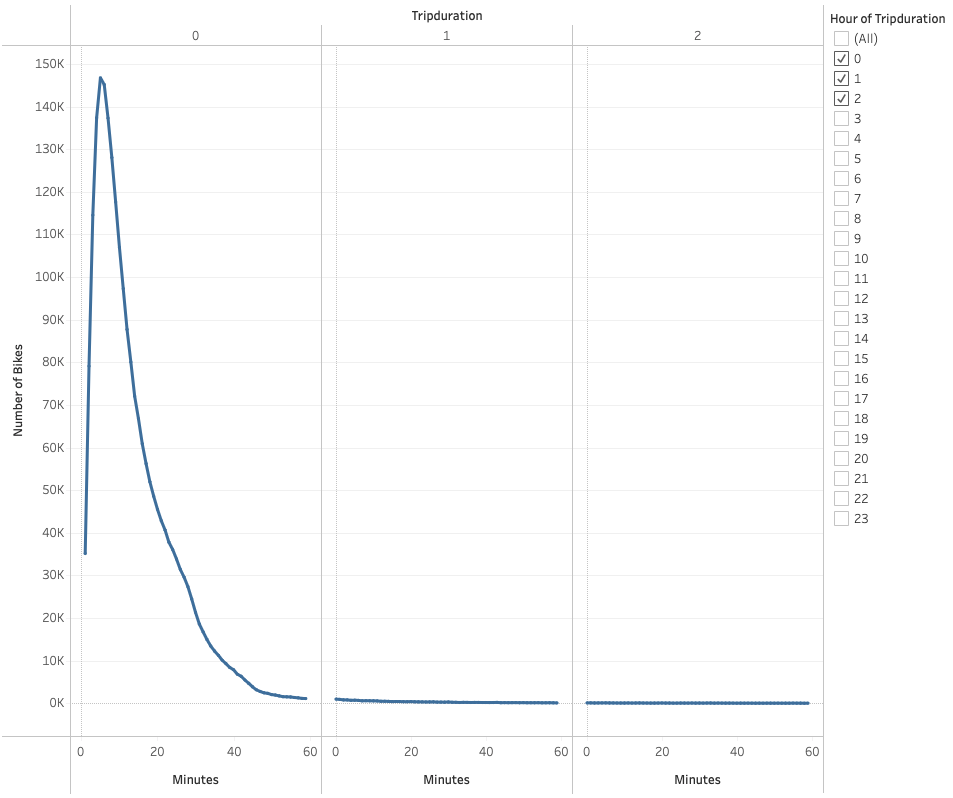
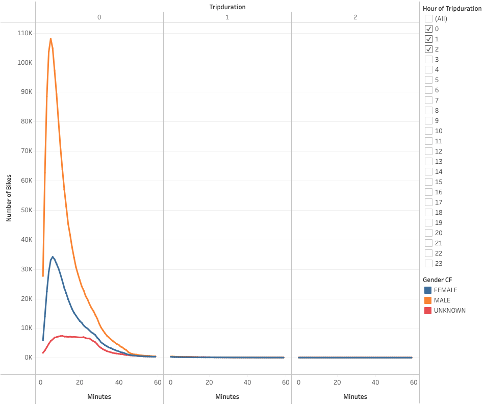
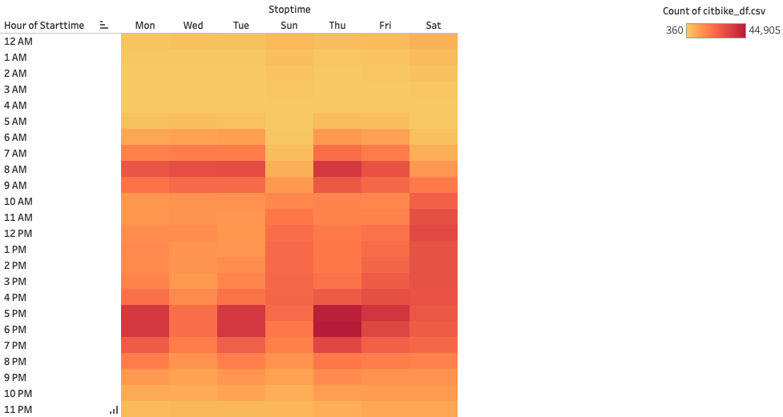
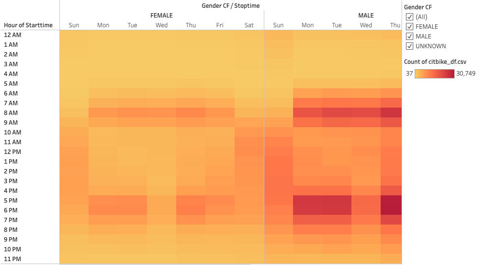
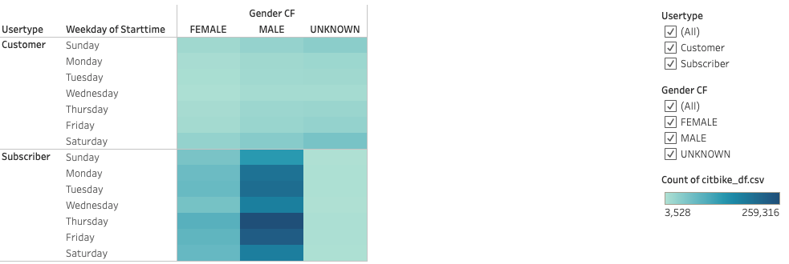
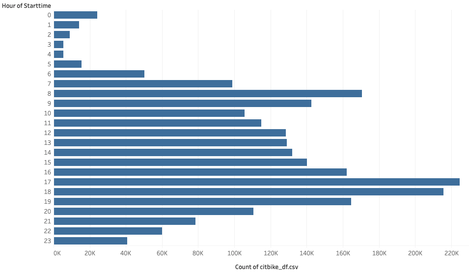
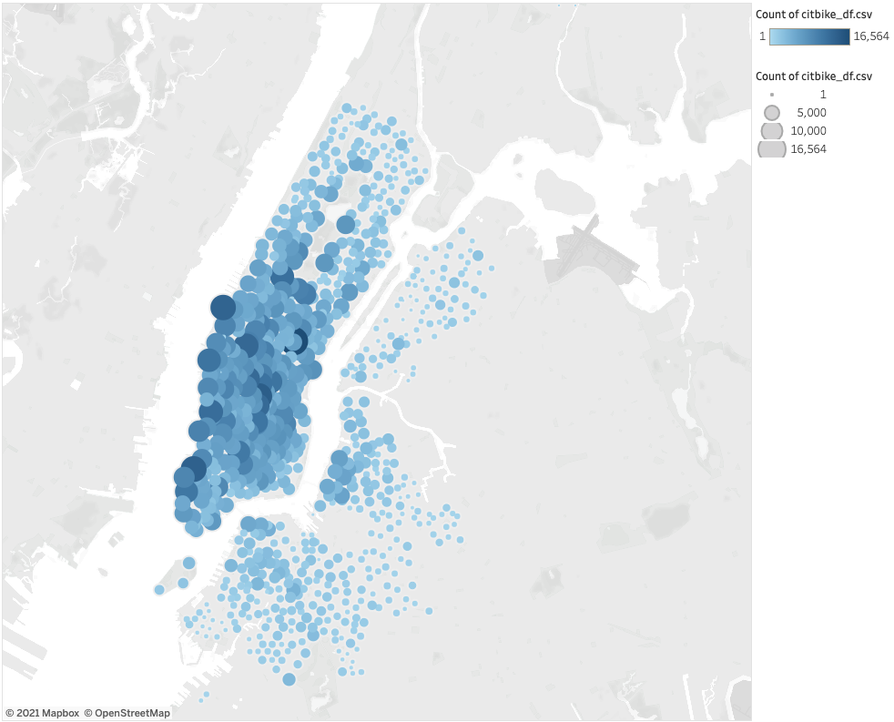

# Bikesharing Challenge

[Link to the story](https://public.tableau.com/app/profile/sean.draper/viz/CitiBikeChallenge_16380398425380/CitiBikeChallengeStory?publish=yes)

## Overview of the analysis

The purpose of this analysis was to create a visualization of bike sharing data for New York City in order to create a proposal that a bike sharing program would be a good idea for Des Moines. We used Tableau public to create multiple visualizations for our analysis. Once the visualizations were complete, we compiled them into a Tableau story. This story is available at the link above.

## Results

### Checkout Times for Users

In this visualization we compared the number of bikers with the duration of their trips. We can see that the most bikers take very short trips with the peak number of 146,752 bikers taking a trip of 5 minutes. There were over 100,000 bikers for each trip duration been 3 and 10 minutes. After 10 minutes, the number of total bikers tapers off drastically. Relevant image is located below.

### Checkout Times by Gender

In this visualization we added on to the previous visualization by applying gender to the mix. We can see that there are many more males than females that checkout bikes with 108,087 bikes rented by males at the peak time of 5 minutes versus only 34,151 at the peak time of females at 6 minutes. But there is a strong correlation for the duration of the trip between male and female as both genders mostly ride between 4 and 10 minutes. Relevant image is located below.

### Trips by Weekday per Hour

In this visualization we created a heatmap to see the count of riders during peak times throughout the week. We compared the hour of the day with the day of the week. We can see the most riders bike between 7am and 9am Monday through Friday then come home between 5pm and 7pm Monday through Friday. The weekends show the inverse result with roughly the same number of riders between 10am and 4pm with much less before 9am and after 8pm. Relevant image is located below.

### Trips by Gender (Weekday per Hour)

In this visualization we added on to the previous once again by comparing gender. We again see that the number of female riders is much less than male. We can also see that there is a strong correlation between male and female for the times that bikes are rented with 7am and 9am Monday through Friday then come home between 5pm and 7pm Monday through Friday. The inverse is once again present on the weekends. Relevant image is located below.

### User Trips by Gender by Weekday

In this visualization we compared customers and subscribers with male and female using a heat map. We can see that there are many more subscribers for both male and female that are renting bikes Monday through Friday. We can also see that there is an uptick of unsubscribed renters on the weekends versus the weekday. This applies to both male and female as well as unknown. Relevant image is located below.

### August Peak Hours

In this visualization we created a bar graph to show the number of customers that were renting bikes by hour in the day. We can see that the peak times for renting were the 8am hour as well as between 6pm and 7pm. This correlated with people who are leaving for work then coming back home in the evening. Relevant image is located below.

### Top Starting Locations

In this visualization we created a heat map of the top starting locations for renters in New York City. The vast majority of renters start in Manhattan primarily in the southern portion of the area. There are far fewer renters outside of Manhattan and the further you get away from Manhattan, the fewer renters there are. Relevant image is located below.

## Summary

Based on this analysis, it is apparent that a bike sharing program would be successful in Des Moines. Based on the results in New York, we can see that males use bike sharing much more frequently than females and that most rides are taken to commute to and from work. We can also see that the majority of rides are taken in higher populated areas. There are additional analysis that could be run to provide further support for a bike sharing program in Des Moines:

- First, we could create a bar graph comparing the user's age with the number of trips they took. This way we could see what age demographic uses bike sharing the most. Then we could compare this with the age demographic in Des Moines.

- Second,  we could create a bar graph comparing the number of users that ride by month. This could help us to figure out if bike sharing happens more or less often in the hot or cold months. We could then provide incentives during the off months to offset losses.